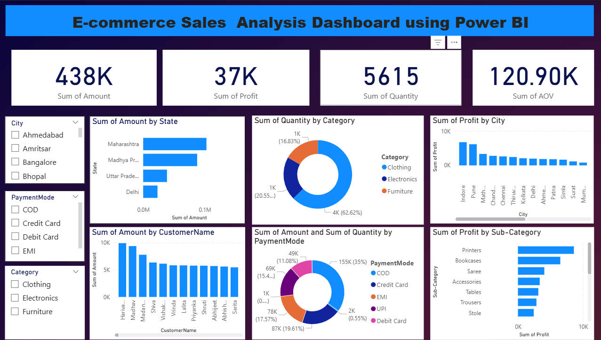

# 📊 E-commerce Sales Analysis Dashboard using Power BI

## 📘 Project Overview  
This Power BI dashboard provides a **comprehensive analysis of E-commerce sales performance** using interactive visualizations and key performance indicators (KPIs).  
It enables business users to monitor **revenue, profit, quantity sold, and average order value (AOV)** across multiple dimensions such as *state, city, category, sub-category, customer,* and *payment mode.*

---

## 🎯 Objective  
To design an interactive **E-commerce Sales Analysis Dashboard using Power BI** that helps management track sales trends, identify top-performing areas, and make **data-driven business decisions.**

---

## 🗂️ Dataset Description  
The dataset (Excel source) includes the following columns:
- 🧾 Order ID  
- 👤 Customer Name  
- 🌆 State  
- 🏙️ City  
- 🛍️ Category  
- 🧩 Sub-Category  
- 💳 Payment Mode  
- 📦 Quantity  
- 💰 Amount (Sales)  
- 💵 Profit  

---

## ⚙️ Data Cleaning & Transformation (Power Query)
- Loaded data from Excel using *Get Data → Excel Workbook*  
- Removed duplicates and null values  
- Converted data types (Date, Decimal, Whole Number)  
- Created calculated columns where needed (e.g., AOV = Amount / Quantity)  
- Loaded clean data into Power BI Model  

---

## 📈 Dashboard Visuals
| Visual                                            | Purpose                                                |
| ------------------------------------------------- | ------------------------------------------------------ |
| **Card Visuals (KPI)**                            | Display key metrics – Sales, Profit, Quantity, and AOV |
| **Bar Chart (Sum of Amount by State)**            | Identify top-performing states                         |
| **Column Chart (Sum of Profit by City)**          | Compare profit across cities                           |
| **Donut Chart (Sum of Quantity by Category)**     | Analyze category-wise product performance              |
| **Bar Chart (Sum of Profit by Sub-Category)**     | Show profit distribution across product types          |
| **Pie Chart (Amount & Quantity by Payment Mode)** | Identify popular payment methods                       |
| **Bar Chart (Sum of Amount by CustomerName)**     | Highlight top customers contributing to sales          |
----
##📊 Insights & Findings
---

✅ Maharashtra and Madhya Pradesh contribute the highest sales.

✅ Electronics category generates the maximum revenue.

✅ Credit Card is the most used payment mode.

✅ Certain sub-categories (e.g., Printers, Bookcases) yield higher profits.

✅ The company can target low-performing categories to improve overall margin.

---
🧠 Tools & Skills Used
---
Power BI Desktop – Dashboard creation & visualization

Power Query – Data cleaning and transformation

DAX (Data Analysis Expressions) – Calculated measures

Excel – Data source

Data Visualization & BI Concepts

---
🏁 Conclusion
---
This project demonstrates the use of Power BI for business analytics, helping decision-makers visualize performance, identify growth opportunities, and optimize sales strategies through data insights.

